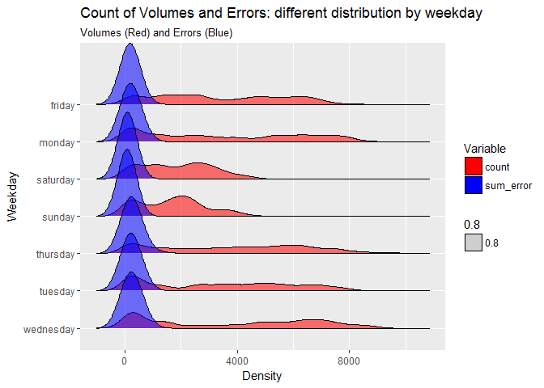
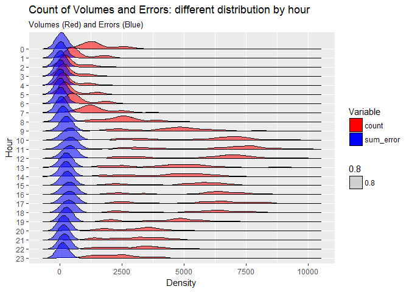

prova
================
ndricca
27 luglio 2017

Time series analysis
--------------------

Univariate and multivariate models for anomaly detection. First attempt of concrete use of GitHub repo.

Setup the environment loading all the necessary packages

Data import
===========

Load data and fill all NAs with 0. Then, see data structure and summary

    ## 'data.frame':    2226 obs. of  6 variables:
    ##  $ date     : POSIXct, format: "2017-04-15 18:00:00" "2017-04-15 19:00:00" ...
    ##  $ root     : Factor w/ 1 level "TSVariable": 1 1 1 1 1 1 1 1 1 1 ...
    ##  $ date_hour: int  18 19 20 21 22 23 0 1 2 3 ...
    ##  $ date_wday: Factor w/ 7 levels "friday","monday",..: 3 3 3 3 3 3 4 4 4 4 ...
    ##  $ count    : int  302 872 801 765 813 392 512 181 36 35 ...
    ##  $ sum_error: int  27 62 36 34 24 15 26 3 3 4 ...

    ##       date                             root        date_hour    
    ##  Min.   :2017-04-15 18:00:00   TSVariable:2226   Min.   : 0.00  
    ##  1st Qu.:2017-05-08 22:15:00                     1st Qu.: 5.25  
    ##  Median :2017-06-01 04:30:00                     Median :11.00  
    ##  Mean   :2017-06-01 04:39:45                     Mean   :11.49  
    ##  3rd Qu.:2017-06-24 10:45:00                     3rd Qu.:17.00  
    ##  Max.   :2017-07-17 15:00:00                     Max.   :23.00  
    ##                                                                 
    ##      date_wday       count        sum_error     
    ##  friday   :312   Min.   :   1   Min.   :   0.0  
    ##  monday   :328   1st Qu.:1019   1st Qu.:  32.0  
    ##  saturday :318   Median :2553   Median : 124.0  
    ##  sunday   :336   Mean   :3088   Mean   : 189.7  
    ##  thursday :311   3rd Qu.:5033   3rd Qu.: 304.0  
    ##  tuesday  :312   Max.   :9826   Max.   :2610.0  
    ##  wednesday:309

Visualisation
=============

Joyplot per weekday and hour: Reshape the dataframe in order to visualize data as expected from ggplot.

Distribution per weekday:

``` r
df2 <- df %>% 
  gather(count, sum_error, key = "Variable", value = "Data") %>%
  arrange(date_wday,date)

df2%>% 
  ggplot(aes(y = as.factor(date_wday) %>% fct_rev())) +
  geom_joy(aes(x = Data, fill = Variable, alpha = 0.8)) +
  scale_fill_manual(values = c("Red", "Blue")) +
  labs(x = "Density",
       y = "Weekday",
       title = "Count of Volumes and Errors: different distribution by weekday",
       subtitle = "Volumes (Red) and Errors (Blue)")
```

    ## Picking joint bandwidth of 334



Distribuzion per hour:

``` r
df3 <- df %>% 
  gather(count, sum_error, key = "Variable", value = "Data") %>%
  arrange(date_hour,date) 
df3 %>% 
  ggplot(aes(y = as.factor(date_hour) %>% fct_rev())) +
  geom_joy(aes(x = Data, fill = Variable, alpha = 0.8)) +
  scale_fill_manual(values = c("Red", "Blue")) +
  labs(x = "Density",
       y = "Hour",
       title = "Count of Volumes and Errors: different distribution by hour",
       subtitle = "Volumes (Red) and Errors (Blue)")
```

    ## Picking joint bandwidth of 235


